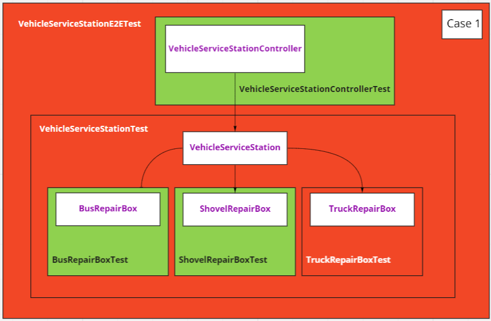
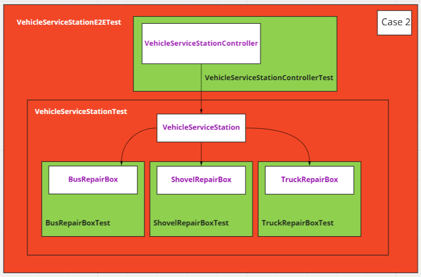
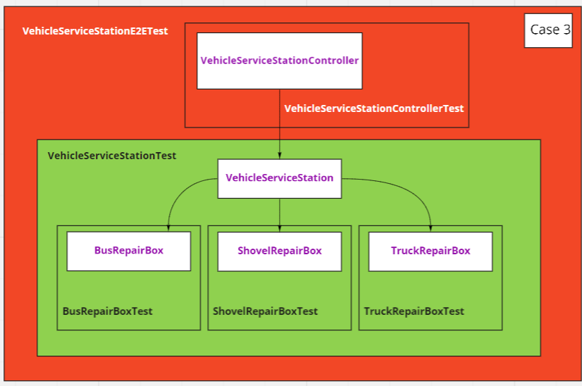
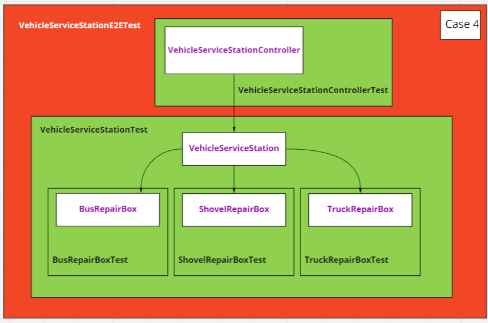

#Характеристики идеальных тестов
- Проверяют всё важное, но не фиксируют неважное. 
- Баланс между числом и охватом 
- Быстро и просто

#Термины:
1. **Компонентный** - тест сервиса/компонента без зависимостей
2. **Интеграционный** - тест сервиса/компонента с зависимостями
3. **E2E** - тест сценария использования

#Критерии бесполезности теста
 - Желаемое поведение не изменилось - тест упал 
 - Желаемое поведение изменилось - тест не упал

#Минусы подходов
E2E тесты: 
- Не масштабируются
- Хрупкие

Компонентные: 
- Не полны

#Подстраховка: Фрактальное тестирование

##Кейсы

###Сломанный компонентный тест:

###Сломанный интеграционный тест:

###Сломанный контракт: 

###Сломанный Е2Е:

#Используемые источники
- [Дмитрий Карловский - Фрактальное тестирование](https://habr.com/ru/post/510824/)
- [Евгений Борисов, Кирилл Толкачев — Проклятие Spring Test](https://www.youtube.com/watch?v=7mZqJShu_3c&t=1644s&ab_channel=JUG.ru)
- [Кирилл Толкачёв — Тестируем и плачем вместе со Spring Boot Test](https://www.youtube.com/watch?v=uc-cfX-5wQA&ab_channel=Heisenbug)